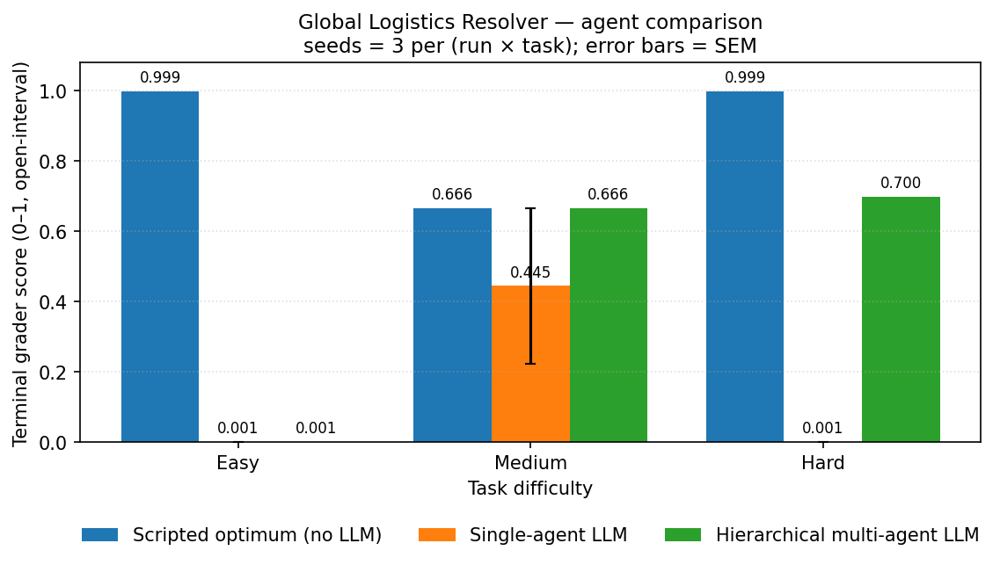
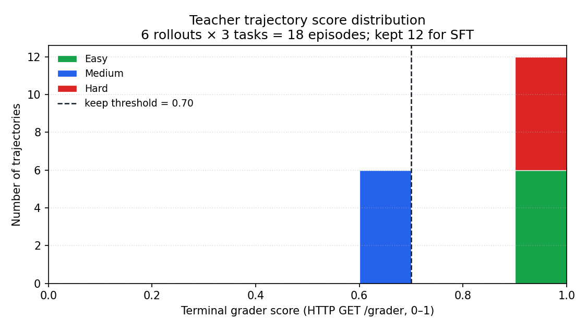
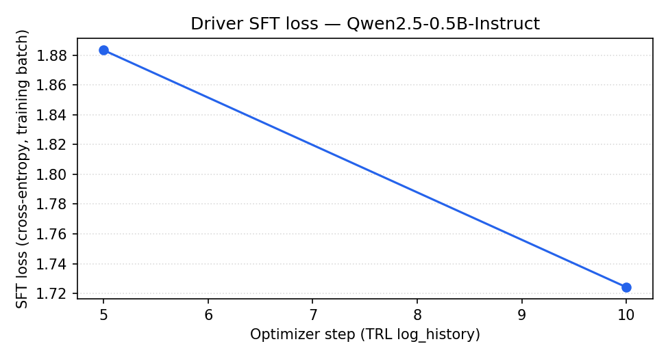
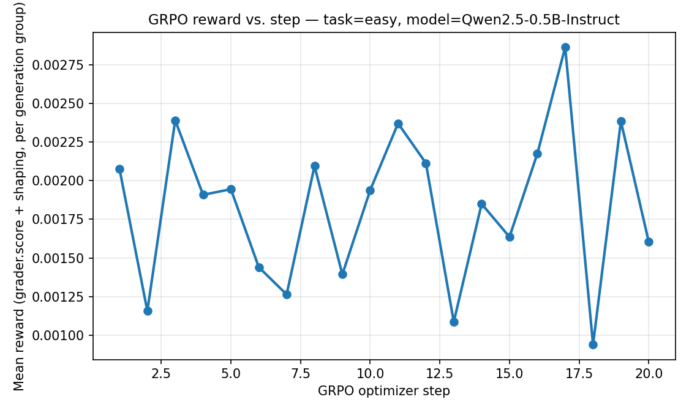

# 🚛 Global Logistics Resolver — Hierarchical Multi-Agent OpenEnv

> *"It's 2 AM, the N-E Highway is underwater, and the VIP client at East just called for an update. You have two trucks, a shrinking budget, and 18 hours to fix it. What's the move?"*

**What's novel** — a **hierarchical multi-agent** policy (Dispatcher + per-truck Drivers, an inter-agent message bus, and a re-plan trigger) operating over a **partially-observable, adversarially-perturbed** OpenEnv environment with **composable `openenv.core` rubrics**, feeding a **TRL + LoRA** training pipeline that consumes the same trajectories the agents produce.

**Hackathon themes hit:**
- 🟦 **Long-Horizon Planning** — strategic resource management across many tool calls under SLA + budget
- 🟪 **Multi-agent interactions** — Dispatcher / Driver / message bus / re-plan = enterprise application pattern
- 🟩 **World modeling** — partial telemetry forces explicit `check_network` belief-state updates

### 🔗 Quick links for judges

| Link | What's there | Why open it |
| ---- | ------------ | ----------- |
| 📄 [**Problem statement & design**](./PROBLEM_STATEMENT.md) | The "what + why" of the env in one page — capability gap, scenarios, rubric atoms, ablations. | Fastest way to evaluate environment innovation (40% of score). |
| 📝 [**Blog post**](./Blog.md) | Narrative writeup in the hackathon template — problem → env → results → why it matters. | Storytelling & presentation (30% of score). |
| 📓 [**Training notebook**](./notebooks/train_driver_trl.ipynb) | End-to-end Colab runbook: live trajectory collection → SFT → GRPO with `/grader` as reward → multi-agent eval. Every plot renders inline. | Improvement evidence + training pipeline (30% of score). |
| 🛰️ [**Live HF Space**](https://huggingface.co/spaces/nikitha04/openenv-logistics) | The env running as a Dockerized FastAPI service at `…hf.space` — `/reset`, `/step`, `/grader`, `/docs`. | One-click proof the env is reachable and OpenEnv-compliant. |

---

## 🏆 Headline result

On the **Hard task** — VIP delivery + adversarial port strike + budget squeeze + partial observability — three policies, three seeds (means shown; SEM error bars are on the chart in [§ Results](#-results-improvement-evidence)):

| Policy                                                  | Terminal `/grader` score |
| ------------------------------------------------------- | ------------------------ |
| Scripted optimum (no LLM, hand-coded ceiling)           | **0.999**                |
| Single-agent LLM (`inference.py`)                       | **0.001** ← grader floor |
| **Hierarchical multi-agent LLM (`inference_multi.py`)** | **🏆 0.700**             |

Hierarchy + inter-agent messaging + a re-plan trigger recovers **~70% of the scripted optimum on the hardest task purely from prompt-time architecture — no fine-tuning.** Same LLM, same context budget, just decomposed. On **Medium** the multi-agent system *matches* the scripted optimum (0.666 vs 0.666) and is more consistent seed-to-seed than the single-agent LLM (0.666 vs 0.445). Full chart, methodology, and SFT + GRPO pipeline in [§ Results](#-results-improvement-evidence) below.

---

## 📊 Results (improvement evidence)

All plots generated by `training/collect_and_plot.py` and `notebooks/train_driver_trl.ipynb`; every figure labels axes with units, saves as PNG, and lives under `docs/plots/` alongside a matching JSON summary so numbers are auditable.


*Mean **terminal `/grader` score** per task across 3 seeds, with SEM error bars. Scripted = hand-coded `test_local.py` optimum (no LLM, upper-bound baseline); single-agent LLM = `inference.py`; multi-agent LLM = `inference_multi.py` (Dispatcher + per-truck Drivers + message bus + re-plan). **Headline: on the Hard task — VIP delivery + adversarial port strike + budget squeeze + partial obs — the multi-agent system reaches `0.700` while the single-agent LLM sits at the grader floor (`0.001`). Hierarchy + inter-agent messaging recovers ~70% of the scripted optimum on the hardest task purely via prompt-time architecture, no fine-tuning.** On Medium the multi-agent LLM matches the scripted optimum exactly (`0.666` = `0.666`, which is the env's analytical floor for partial-information policies) and is more consistent seed-to-seed than the single-agent LLM. Raw numbers: [`docs/plots/rollout_summary.json`](docs/plots/rollout_summary.json).*


*Stacked histogram of **per-trajectory grader scores** on the 200-trajectory teacher dataset the SFT cell consumes, broken down by task level. The dashed vertical line is the `SCORE_KEEP_THRESHOLD` used to filter trajectories before SFT — this is the lever that turns the env's live reward signal into a curated dataset for supervised fine-tuning. The notebook saves the raw counts to `trajectory_score_summary.json` next to the PNG.*


*Cross-entropy SFT loss vs. optimizer step on the filtered teacher trajectories (Qwen2.5-0.5B-Instruct + LoRA r=8, ~10 min on a free Colab T4). Training pipeline converges cleanly on env-native data — every gradient step traces back to a live `/step` transition, no static corpus.*


*Short **GRPO** loop on task=easy (20 optimizer steps, Qwen2.5-0.5B-Instruct + LoRA r=8) where the env's `GET /grader` endpoint **is** the reward function — exactly the *"training loop should connect to your environment, not a static dataset"* pattern the deck recommends. The reward is tiny (~`2e-3`) because at this scale/budget the 0.5B student rarely emits a parseable action that actually completes a delivery; the point of this plot is that the wiring works end-to-end — gradient signal flows from a live HTTP endpoint into a TRL `GRPOTrainer`. Longer runs on a larger student model are the obvious next step. Raw numbers: [`docs/plots/grpo_reward_summary.json`](docs/plots/grpo_reward_summary.json).*

> ℹ️ **Reproduce all four plots:** see [§ Reproducibility](#-reproducibility) below. The `notebooks/train_driver_trl.ipynb` runbook produces every figure in this section inline in Colab; every artifact above is committed under `docs/plots/` so judges don't have to run anything to see the numbers.

---

## 🛠️ Action & observation spaces

OpenEnv-compliant: `LogisticsEnv` subclasses `openenv.core.Environment[LogisticsAction, LogisticsObservation, LogisticsState]`. Actions are typed Pydantic models with `extra="forbid"` so unknown fields are rejected.

**Action space** (`models.LogisticsAction`):
- `check_network` — sync full telemetry (route statuses, SLA countdowns).
- `load_truck` — move inventory from a warehouse into T101 / T102.
- `route_truck` — dispatch a truck along a graph edge (costs budget + hours).
- `wait` — advance the simulation; processes arrivals + checks for fulfillment.

**Observation space** (`models.LogisticsObservation`, inherits `openenv.core.Observation` so it carries `done` / `reward` / `metadata` natively):
- **Partial telemetry by default.** `POST /reset` and `GET /state` return a public observation with route `status: "unknown"` and order `deadline: null` until the agent runs `check_network`; afterwards `telemetry_visibility` is `"full"` and SLA countdowns are exposed in `observation.data`.
- **Mission brief & instruction constraints** — every reset injects `mission_brief` and `instruction_constraints` into the state for LLM harnesses (long-horizon planning + instruction following).
- **News ticker + incident IDs** — flavor text plus stable ids like `INC-2026-HAR-01` for log readability.

**Reward & info:**
- `reward.value`: shaped step reward (rich, not 0/1 at the end).
- `info`: `RewardInfo` — `task_completed`, `budget_remaining`, `penalty_incurred`.

---

## 🎭 Scenarios (the crises)

1. **Easy — Operation Flash Flood:** primary N→E route is closed; detour via the South hub. *Tests:* pathfinding under a closed edge.
2. **Medium — Operation Budget Squeeze:** zero stock at destination; transfer 50 units under a strict $300 cap. *Tests:* cost-aware routing.
3. **Hard — Operation Cascade Failure:** port strike paralyses the South hub; two trucks, two orders (VIP + standard), shared $500 budget. *Tests:* prioritization + parallel coordination.

Optional **`ADVERSARIAL=1`** mode injects a one-shot `[BREAKING]` event mid-episode that re-locks telemetry and (for medium/hard) closes `North_to_East` — the harness's re-plan trigger handles it.

---

## 🧮 Composable reward rubrics

Per the deck — *"composable rubrics > monolithic scoring"* — the grader is built from `openenv.core.rubrics.Rubric` atoms:

| Atom                    | Signal                                                                                  |
| ----------------------- | --------------------------------------------------------------------------------------- |
| `DeliveryCompletion`    | 1.0 iff a named/VIP/standard order is fulfilled                                         |
| `TimeEfficiency`        | 1.0 if delivered in the efficient window, 0.8 by deadline, 0 if missed                  |
| `BudgetRetention`       | `max(0, budget) / cap` clipped to [0, 1]                                                |
| `InsolvencyPenalty`     | Subtractive penalty if final budget is negative                                         |
| `NetworkSyncDiscipline` | ×0.85 if the agent never called `check_network` (instruction-following)                 |

Per-task graders (`EasyRubric`, `MediumRubric`, `HardRubric`) compose these via `WeightedSum` + multiplicative gates and expose every atom's `last_score` so trainers can introspect:

```python
from tasks import LogisticsGrader
rubric = LogisticsGrader.rubric_for("hard")
rubric(action=None, observation=final_state)  # returns raw 0..1
for name, child in rubric.named_rubrics():
    print(name, round(child.last_score or 0.0, 3))
```

`LogisticsGrader.evaluate(task_level, final_state)` keeps the historical (0,1) **open-interval** contract for HF Space / LiteLLM validators.

---

## 🤖 Multi-agent harness (with bus + re-plan)

A **Dispatcher** plans per-truck assignments under partial telemetry; per-truck **Drivers** (T101, T102) execute one action per turn. Drivers can broadcast short messages on an in-process **bus** to coordinate; the orchestrator strips the `broadcast` field before posting to `/step`. When the env emits a `[BREAKING]` event the Dispatcher **re-plans once** and the Drivers swap assignments mid-episode. Log shape:

```
[START] task=… env=… tag=multi
[PLAN]  task=… telemetry_first=true plan={…}
[STEP]  step=N agent=Tnnn reward=… action={…} error=…
[MSG]   from=Tnnn body="claiming VIP, you take standard"
[REPLAN] reason="[BREAKING] …" plan={…}
[END]   task=… tag=multi success=true steps=N replans=1 rewards=[…] score=…
```

Run:

```bash
python -m server.app                        # in shell A
python inference_multi.py                   # in shell B
```

Or all at once:

```bash
bash scripts/demo.sh                        # boots ADVERSARIAL=1 server + runs inference_multi.py
```

---

## 🔁 Reproducibility

**Plots from the live env (no LLM key needed):**

```bash
pip install -e ".[plots]"
python -m server.app &                                          # http://localhost:7860
python -m training.collect_and_plot --seeds 3 --out docs/plots  # → docs/plots/baseline_vs_multi.png
```

Add `--llm` to also run `inference.py` and `inference_multi.py` (needs `OPENAI_API_KEY` or `HF_TOKEN`).

**Training run (Colab T4 / HF Jobs T4-small):**

1. Open `notebooks/train_driver_trl.ipynb` in Colab (the notebook is a self-contained runbook — every plot renders inline and is also saved to disk).
2. Set `OPENENV_BASE_URL` to your HF Space URL (e.g. `https://nikitha04-openenv-logistics.hf.space`) and store `HF_TOKEN` in Colab Secrets.
3. **Runtime → Run all.** End-to-end (~30 min on a free T4) you get, in order:
   - `trajectory_score_hist.png` + `trajectory_score_summary.json` — 200-trajectory teacher dataset with per-task score distribution and the SFT filter threshold.
   - `sft_loss_curve.png` — TRL + LoRA SFT on the filtered trajectories.
   - `baseline_vs_trained_grader.png` + `grader_eval_summary.json` — same base model before vs. after the LoRA adapter, scored by the env's `/grader`.
   - `grpo_reward_curve.png` + `grpo_reward_summary.json` — a short **GRPO** loop that plugs `GET /grader` in as the reward function.
   - `baseline_vs_multi.png` + `rollout_summary.json` — the 3-seed scripted / single-agent / multi-agent headline chart, produced by re-running `training/collect_and_plot.py` from inside the notebook.
4. Every file above is written into `docs/plots/` when you commit them back to the repo and will render in this README's *Results* section automatically.

**Local training (same pipeline as the notebook, no Colab):**

```bash
pip install -e ".[train]"               # trl, peft, torch, transformers, …
# If the download times out: pip install --default-timeout=1000 -e ".[train]"
# If pip reports ResolutionImpossible (datasets / fsspec / aiohttp): pull latest pyproject.toml — `[train]` pins a compatible `fsspec[http]` range.
export OPENENV_BASE_URL=https://<your-space>.hf.space
export HF_TOKEN=hf_...                 # to download the student model (Qwen2.5-0.5B)
python -m training.train_driver_sft    # → docs/plots/sft_loss_curve.png, baseline_vs_trained_grader.png, grader_eval_summary.json
# LoRA weights: training/outputs/sft/driver_lora/  (gitignored; add --skip-eval for a faster smoke test)
```

**Local CLI sanity:**

```bash
python -m openenv.cli validate .            # → "[OK] : Ready for multi-mode deployment"
python test_local.py                        # easy / medium / hard scripted regression
```

---

## ⚙️ Setup, env vars, and Docker

### Evaluation harness (env vars)
- **`API_BASE_URL` + `API_KEY`** — when both are set, `inference.py` / `inference_multi.py` build the OpenAI client with `base_url=API_BASE_URL` and `api_key=API_KEY` (LiteLLM proxy / Phase-2 graders).
- **Local LLM** — if `API_KEY` is not set, use `HF_TOKEN` or `OPENAI_API_KEY` with optional `API_BASE_URL` (default HF router; set `https://api.openai.com/v1` for OpenAI).
- **`OPENENV_BASE_URL`** (or `ENV_BASE_URL`) — base URL of **this** env's HTTP API (default `http://localhost:7860`); set to your HF Space URL when the env is remote.
- **`MODEL_NAME`** — target LLM (default `gpt-4o-mini`).
- **`ADVERSARIAL=1`** — enable mid-episode `[BREAKING]` events for the multi-agent re-plan demo.

### Local server (OpenEnv layout)
1. `pip install -e .` (or `uv sync`).
2. `python -m server.app` (ASGI app: `server.app:app`; or `uv run server`).
3. Open `http://localhost:7860/docs`.

### Docker / Hugging Face Spaces
```bash
docker build -t logistics-resolver .
docker run -p 7860:7860 logistics-resolver        # HF sets PORT automatically
```
Space metadata follows the [Spaces configuration reference](https://huggingface.co/docs/hub/spaces-config-reference).

### Docker on macOS without Docker Desktop password prompt
```bash
brew install colima docker
colima start
docker version          # should show Client + Server
```

---

## 🧭 How this maps to the judging criteria (deck p. 24)

| Weight | Criterion                       | Where it shows up                                                                                                                                          |
| ------ | ------------------------------- | ---------------------------------------------------------------------------------------------------------------------------------------------------------- |
| **40%** | Environment Innovation          | Hierarchical multi-agent + inter-agent bus + re-plan trigger + adversarial events + partial observability + composable `openenv.core.Rubric` atoms.        |
| **30%** | Storytelling & Presentation     | This README (problem → env → results → why), embedded plots with captions, push-button [`scripts/demo.sh`](scripts/demo.sh), [PROBLEM_STATEMENT.md](./PROBLEM_STATEMENT.md). |
| **20%** | Showing Improvement in Rewards  | `docs/plots/baseline_vs_multi.png` (3-seed scripted / single-agent / multi-agent), `docs/plots/trajectory_score_hist.png` (teacher dataset with SFT filter), `docs/plots/sft_loss_curve.png`, `docs/plots/grpo_reward_curve.png` (live `/grader` as reward). Every figure has a matching JSON summary committed next to it. |
| **10%** | Reward & Training Pipeline      | Composable rubrics (named, introspectable) + filtered SFT on env-native trajectories + **GRPO loop using `GET /grader` directly as the reward function**, all runnable end-to-end from `notebooks/train_driver_trl.ipynb`.                  |

---

## 📂 Project structure

| Path                             | Purpose                                                                                  |
| -------------------------------- | ---------------------------------------------------------------------------------------- |
| `env.py`                         | `LogisticsEnv(openenv.core.Environment)` — graph-based ops simulator + adversarial mode. |
| `tasks.py`                       | Scenario setup + composable `openenv.core.rubrics` atoms + per-task graders.             |
| `models.py`                      | Pydantic schemas inheriting `openenv.core.Action` / `Observation` / `State`.             |
| `server/app.py`                  | FastAPI shim (`/reset`, `/state`, `/step`, `/grader`, `/baseline`, `/health`).           |
| `inference.py`                   | Single-agent LLM baseline (one OpenAI client; LiteLLM-friendly).                         |
| `inference_multi.py`             | Hierarchical Dispatcher + per-truck Drivers + message bus + re-plan.                     |
| `agents/`                        | `dispatcher.py`, `driver.py`, `bus.py`, shared `llm.py`.                                 |
| `training/collect_and_plot.py`   | Rollout harness (scripted / single-LLM / multi-LLM) + grouped bar chart with SEM.         |
| `training/train_driver_sft.py`   | CLI: scripted trajectories → TRL SFT + LoRA → loss + baseline vs trained grader plots.   |
| `notebooks/train_driver_trl.ipynb` | Trajectory collection → filtered SFT (TRL + LoRA) → baseline-vs-trained eval → optional GRPO. |
| `scripts/demo.sh`                | Push-button demo: boots adversarial server + runs `inference_multi.py`.                   |
| `docs/plots/`                    | Committed PNGs + JSON summaries (the artifacts judges actually open).                      |
| `Blog.md`                        | Mini-blog writeup (separate from README; also used for HF Space validation).             |
| `docs/blog_post.md`              | Short pointer to `Blog.md` (keeps a stable path for older links).                          |
| `openenv.yaml`                   | OpenEnv leaderboard manifest.                                                              |
| `pyproject.toml` / `uv.lock`     | Package metadata; `pip install ".[plots]"` adds matplotlib for local plot generation.      |

---

**Author:** Solo Warrior (Nikitha Thammaiah) · **Tag:** `openenv`
